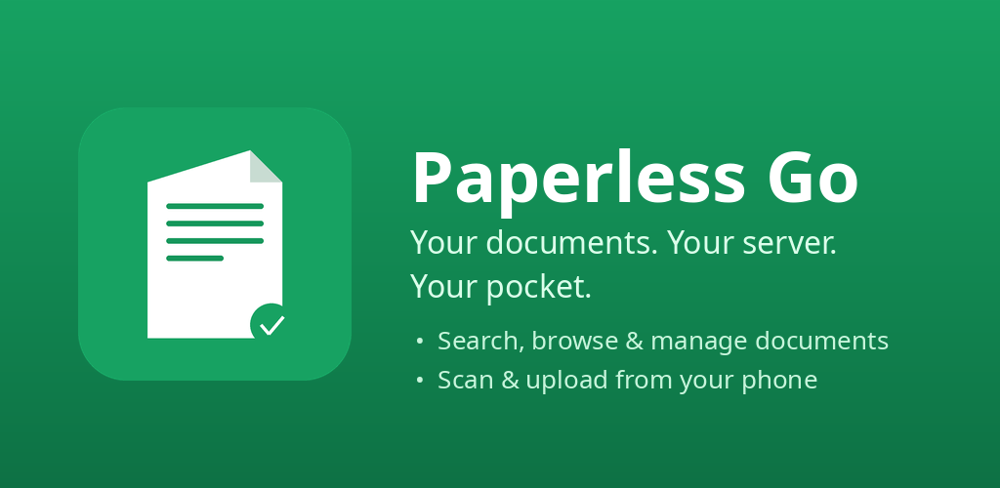
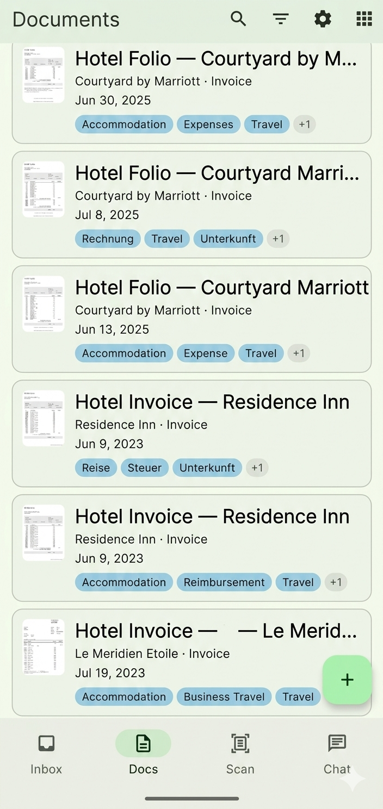
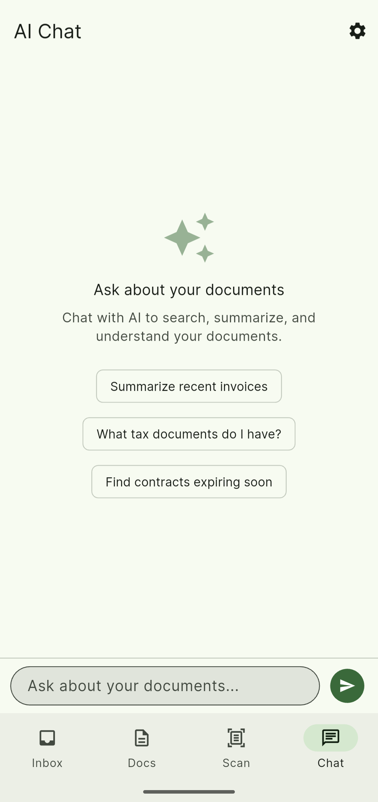
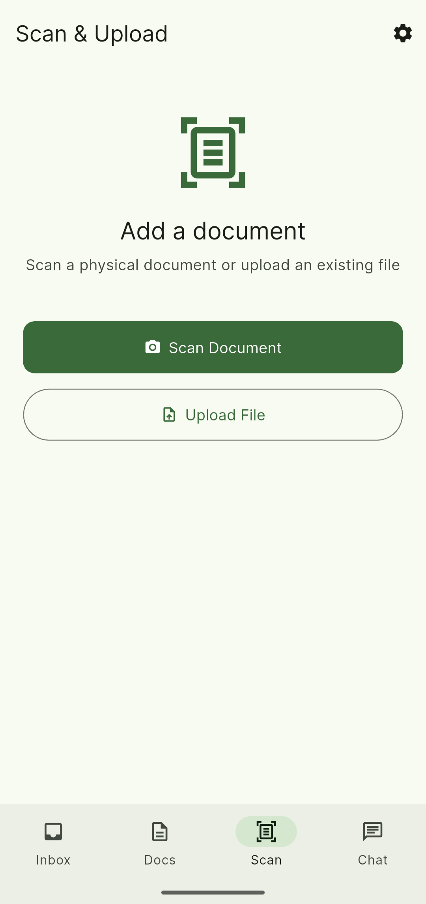

# Paperless Go

A modern, open-source mobile client for [Paperless-ngx](https://github.com/paperless-ngx/paperless-ngx) — the self-hosted document management system.



## Screenshots

<p align="center">
  
  
  
</p>

## Features

- **Document browsing** — Search, filter, and sort your entire library with full-text search and autocomplete
- **PDF viewer** — View document previews and thumbnails inline
- **Scan & upload** — Capture documents with the camera scanner or pick files, with share-intent support from other apps
- **Label management** — Create and edit tags, correspondents, document types, and storage paths
- **Metadata editing** — Update document fields including custom fields
- **Bulk operations** — Tag, re-tag, delete, and more across multiple documents
- **AI chat** — Ask questions about your documents via Paperless-AI integration
- **Biometric auth** — Secure access with fingerprint or face unlock
- **Offline caching** — Browse previously loaded documents without a connection
- **Trash management** — View and restore deleted documents

## Requirements

- A running [Paperless-ngx](https://github.com/paperless-ngx/paperless-ngx) instance (v2.x+)
- An API token (generate one from your Paperless-ngx user profile)
- Android 6.0+ (API 23+)

## Getting Started

1. Install the app (see [Releases](https://github.com/bearyjd/paperless-go/releases) or build from source)
2. Enter your Paperless-ngx server URL (e.g., `https://paperless.example.com`)
3. Log in with your username and password, or paste an API token
4. Start managing your documents

## Building from Source

```bash
# Clone the repo
git clone https://github.com/bearyjd/paperless-go.git
cd paperless-go

# Install dependencies
flutter pub get

# Generate model code
dart run build_runner build --delete-conflicting-outputs

# Run in debug mode
flutter run

# Build release APK
flutter build apk --release
```

### Prerequisites

- [Flutter](https://docs.flutter.dev/get-started/install) 3.9+
- Dart 3.9+
- Android SDK

## Tech Stack

| Layer | Technology |
|---|---|
| Framework | Flutter |
| State Management | Riverpod |
| HTTP Client | Dio |
| Navigation | GoRouter |
| Local Database | Drift (SQLite) |
| Auth Storage | flutter_secure_storage |
| PDF Viewing | pdfx |
| Scanner | cunning_document_scanner |

## Contributing

Contributions are welcome! Please open an issue or submit a pull request.

1. Fork the repo
2. Create a feature branch (`git checkout -b feature/my-feature`)
3. Commit your changes
4. Push to the branch and open a PR

## License

This project is licensed under the [GNU General Public License v3.0](LICENSE).

## Acknowledgments

- [Paperless-ngx](https://github.com/paperless-ngx/paperless-ngx) — the document management system this app connects to
- [Paperless-AI](https://github.com/clusterpj/paperless-ai) — AI chat integration
