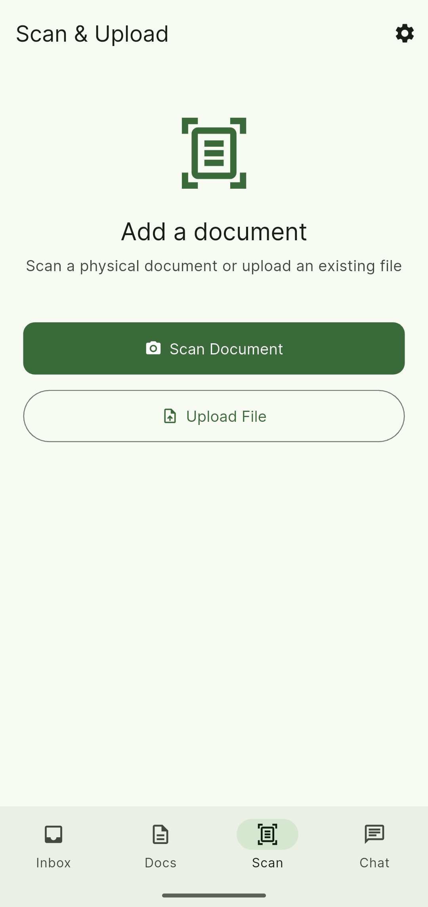
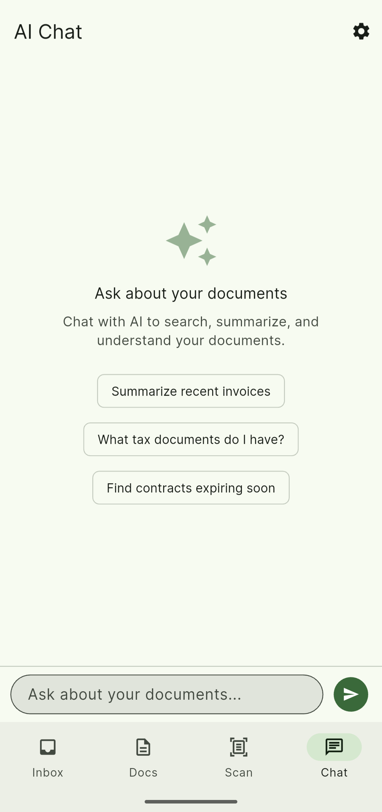
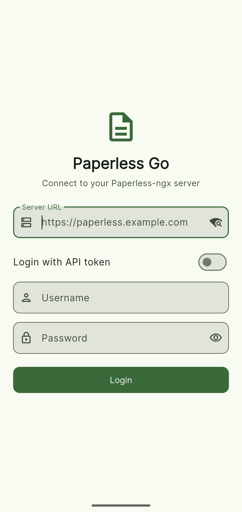

<p align="center">
  
</p>

<p align="center">
  <strong>Your documents. Your server. Your pocket.</strong>
</p>

<p align="center">
  <a href="https://github.com/bearyjd/paperless-go/releases/latest"></a>
  <a href="https://f-droid.org/packages/com.ventoux.paperlessgo"></a>
  <a href="LICENSE"></a>
  <a href="https://flutter.dev"></a>
</p>

---

A modern, open-source mobile client for [Paperless-ngx](https://github.com/paperless-ngx/paperless-ngx) — the self-hosted document management system. Browse, search, scan, upload, and manage your entire document library from your phone.

<p align="center">
  
  &nbsp;&nbsp;
  
  &nbsp;&nbsp;
  
  &nbsp;&nbsp;
  
</p>

## Install

[](https://f-droid.org/packages/com.ventoux.paperlessgo)
[](https://github.com/bearyjd/paperless-go/releases/latest)

> **F-Droid** — Free, built without Google ML Kit (pure-Dart deskew fallback)
> **GitHub Releases** — Includes ML Kit for better document deskew and OCR suggestions

## Features

### Core
- **Full-text search** with autocomplete across your entire library
- **Advanced filtering** by tags, correspondent, document type, date range
- **Saved views** — reusable filter and sort combinations
- **Similar documents** — find related documents by content
- **PDF viewer** with inline thumbnails and previews

### Capture
- **Camera scanner** with six image presets (Auto, Receipt, B&W, Color Doc, Photo)
- **File upload** from device storage
- **Share intent** — send files from any app directly to Paperless
- **Document templates** — save reusable upload presets

### Edit & Organize
- **Label management** — tags, correspondents, document types, storage paths
- **Metadata editing** with custom fields
- **PDF annotation** — draw, highlight, redact, export back to server
- **Bulk operations** — tag, re-tag, delete, batch OCR, merge
- **Inbox quick-assign** with swipe gestures
- **Document notes** and **share links** with expiration

### Intelligence
- **AI chat** — ask questions about your documents via [Paperless-AI](https://github.com/clusterpj/paperless-ai) integration
- **OCR metadata suggestions** — auto-suggest title, correspondent, tags from scanned text (ML Kit builds)

### Mobile-First
- **Offline caching** — SQLite-backed, browse without connection
- **Offline edit queue** — queue changes, auto-sync on reconnect
- **Biometric auth** — app-level and per-document fingerprint/face lock
- **Dark mode** — system-aware with manual override
- **Home screen widget** — document count + quick-launch scan/upload
- **Multi-server** — switch between Paperless-ngx instances
- **Trash management** — view and restore deleted documents

## Requirements

- [Paperless-ngx](https://github.com/paperless-ngx/paperless-ngx) v2.x+ (self-hosted)
- Android 6.0+ (API 23)

## Getting Started

1. Install from F-Droid, GitHub Releases, or build from source
2. Enter your server URL (e.g. `https://paperless.example.com`)
3. Log in with username/password or paste an API token
4. Start managing your documents

## Build from Source

```bash
git clone https://github.com/bearyjd/paperless-go.git
cd paperless-go
flutter pub get
dart run build_runner build --delete-conflicting-outputs
flutter run
```

**Prerequisites:** [Flutter](https://docs.flutter.dev/get-started/install) stable (3.41+), Android SDK (API 23+)

Release build with obfuscation:
```bash
flutter build apk --release --obfuscate --split-debug-info=./debug-info/
```

## Tech Stack

| Layer | Technology |
|---|---|
| Framework | [Flutter](https://flutter.dev) |
| State | [Riverpod](https://riverpod.dev) |
| HTTP | [Dio](https://pub.dev/packages/dio) |
| Navigation | [GoRouter](https://pub.dev/packages/go_router) |
| Database | [Drift](https://drift.simonbinder.eu) (SQLite) |
| Auth Storage | [flutter_secure_storage](https://pub.dev/packages/flutter_secure_storage) |
| PDF | [pdfx](https://pub.dev/packages/pdfx) |
| Scanner | [cunning_document_scanner](https://pub.dev/packages/cunning_document_scanner) |
| Biometrics | [local_auth](https://pub.dev/packages/local_auth) |
| Widget | [home_widget](https://pub.dev/packages/home_widget) |
| OCR | [google_mlkit_text_recognition](https://pub.dev/packages/google_mlkit_text_recognition) |

## Contributing

Contributions welcome! Please open an issue first to discuss what you'd like to change.

1. Fork the repo
2. Create a feature branch (`git checkout -b feature/my-feature`)
3. Commit your changes using [conventional commits](https://www.conventionalcommits.org/)
4. Push and open a PR

## Privacy

Paperless Go does not collect, store, or transmit any user data to the developer or any third party. All data stays between your device and your Paperless-ngx server. [Full privacy policy](PRIVACY_POLICY.md).

## License

[GNU Affero General Public License v3.0](LICENSE) — free to use, modify, and distribute. Source must remain open.

## Acknowledgments

- [Paperless-ngx](https://github.com/paperless-ngx/paperless-ngx) — the document management system
- [Paperless-AI](https://github.com/clusterpj/paperless-ai) — AI chat integration
