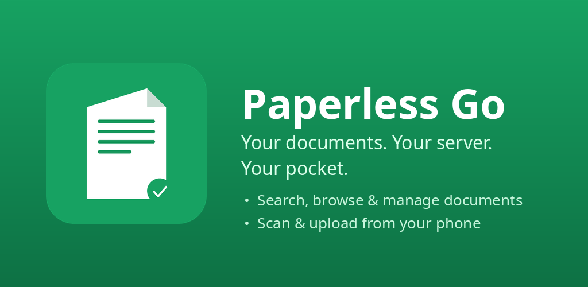
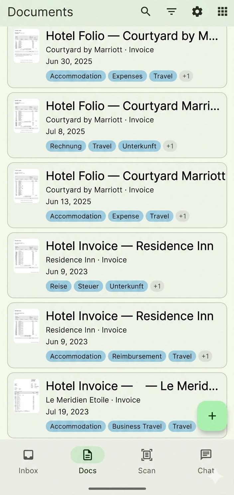

# Paperless Go

A modern, open-source mobile client for [Paperless-ngx](https://github.com/paperless-ngx/paperless-ngx) — the self-hosted document management system.



## Screenshots

<p align="center">
  
  
  
</p>

## Features

- **Document browsing** — Search, filter, and sort your entire library with full-text search and autocomplete
- **PDF viewer** — View document previews and thumbnails inline
- **Scan & upload** — Capture documents with the camera scanner or pick files, with share-intent support from other apps
- **Image enhancement** — Six processing presets (Auto, Receipt, B&W Text, Color Doc, Photo) with deskew, adaptive contrast, shadow removal, and denoising
- **PDF annotation** — Draw, highlight, and annotate documents with a full canvas tool; export composited annotations back to Paperless-ngx
- **Document templates** — Save reusable upload presets (title, tags, correspondent, document type) and apply them during upload
- **Label management** — Create and edit tags, correspondents, document types, and storage paths
- **Metadata editing** — Update document fields including custom fields
- **Document notes** — Add, view, and delete notes on any document
- **Batch OCR** — Re-run OCR on multiple documents from the bulk action bar
- **Share links** — Generate public share links with optional expiration
- **Bulk operations** — Tag, re-tag, delete, and more across multiple documents
- **Saved views** — Save and reuse custom filter and sort combinations
- **Similar documents** — Find related documents using content similarity
- **Advanced filtering** — Filter by tags, correspondent, document type, and date range
- **Flexible sorting** — Sort by date created, recently added, title, or archive serial number
- **Inbox quick-assign** — Swipe gestures to rapidly triage new documents
- **Download & share** — Save documents to your device or share via the native share sheet
- **AI chat** — Ask questions about your documents via Paperless-AI integration
- **Multi-server support** — Switch between multiple Paperless-ngx instances
- **Dark mode** — System-aware dark theme with manual override
- **Biometric auth** — App-level and per-document biometric lock (fingerprint or face unlock)
- **Offline edit queue** — Queue metadata edits while offline; auto-syncs on reconnect with coalescing
- **Offline caching** — Browse previously loaded data without a connection; workflows and labels cached locally
- **Home screen widget** — Android widget showing document count with quick-launch scan and upload buttons
- **Trash management** — View and restore deleted documents

## Requirements

- A running [Paperless-ngx](https://github.com/paperless-ngx/paperless-ngx) instance (v2.x+)
- An API token (generate one from your Paperless-ngx user profile)
- Android 6.0+ (API 23+)

## Getting Started

1. Install the app (see [Releases](https://github.com/bearyjd/paperless-go/releases) or build from source)
2. Enter your Paperless-ngx server URL (e.g., `https://paperless.example.com`)
3. Log in with your username and password, or paste an API token
4. Start managing your documents

## Building from Source

```bash
# Clone the repo
git clone https://github.com/bearyjd/paperless-go.git
cd paperless-go

# Install dependencies
flutter pub get

# Generate model code
dart run build_runner build --delete-conflicting-outputs

# Run in debug mode
flutter run

# Build release APK
flutter build apk --release
```

### Prerequisites

- [Flutter](https://docs.flutter.dev/get-started/install) (latest stable, bundling Dart 3.9.2+)
- Android SDK (API 23+)

## Tech Stack

| Layer | Technology |
|---|---|
| Framework | Flutter |
| State Management | Riverpod |
| HTTP Client | Dio |
| Navigation | GoRouter |
| Local Database | Drift (SQLite) |
| Auth Storage | flutter_secure_storage |
| PDF Viewing | pdfx |
| Scanner | cunning_document_scanner |
| Biometric Auth | local_auth |
| Home Screen Widget | home_widget |
| OCR | google_mlkit_text_recognition |

## Contributing

Contributions are welcome! Please open an issue or submit a pull request.

1. Fork the repo
2. Create a feature branch (`git checkout -b feature/my-feature`)
3. Commit your changes
4. Push to the branch and open a PR

## License

This project is licensed under the [GNU Affero General Public License v3.0](LICENSE).

## Acknowledgments

- [Paperless-ngx](https://github.com/paperless-ngx/paperless-ngx) — the document management system this app connects to
- [Paperless-AI](https://github.com/clusterpj/paperless-ai) — AI chat integration
